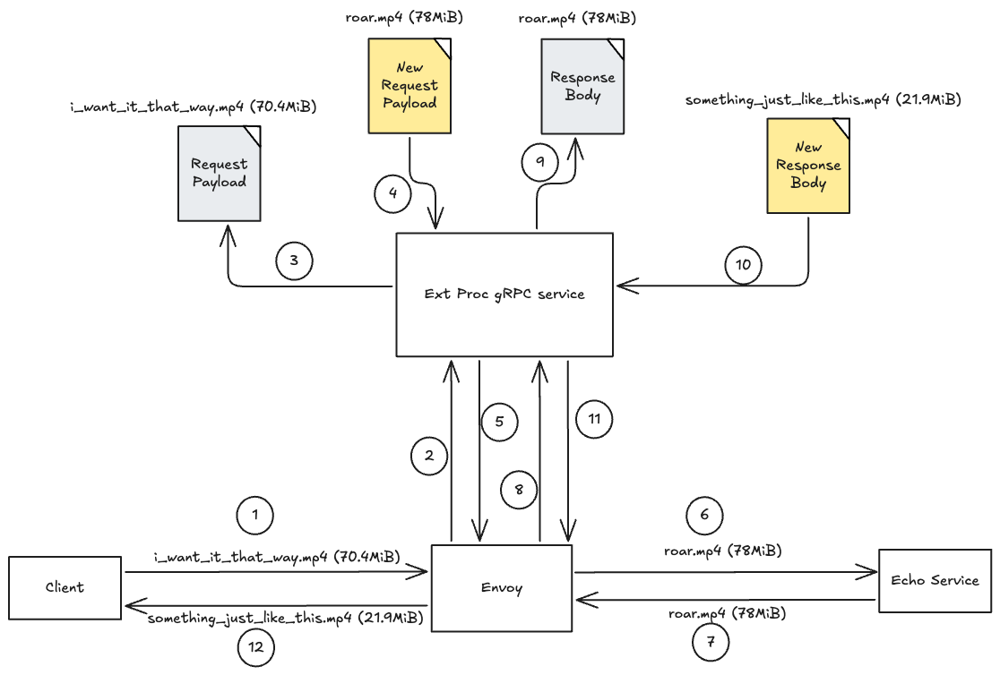

# envoy-ext-proc-body-streaming

POC on using Envoy External Processor (ext proc) to process body in streaming mode.

Please update the netty-echo image in [docker-compose.yaml](docker-compose.yaml) to the image that matches your local environment architecture.



## 1. Full Duplex Streaming Mode

### Start Envoy Docker Compose

```sh
docker compose down; docker compose up -d; docker compose logs -ft
```

### Run Ext Proc Service

```sh
cd external-processor-full-duplex-stream;
go run main.go -write_data_to_file
```

### Check Memory Consumption

```sh
docker compose stats envoy
```

### Test the Ext Proc Service

```sh
for i in {1..10}; do
    curl --location 'http://localhost:18080/full-duplex-streamed' -vvv \
    --header 'Content-Type: video/mp4' \
    --data-binary '@./resources/i_want_it_that_way.mp4' -o "./temp/response-${i}.mp4" &;
done
```

```log
CONTAINER ID   NAME                                    CPU %     MEM USAGE / LIMIT   MEM %     NET I/O           BLOCK I/O   PIDS
334709c09931   envoy-ext-proc-body-streaming-envoy-1   0.82%     527.6MiB / 1GiB     51.52%    2.52GB / 2.49GB   0B / 0B     12
```

### Clean Up

1.  Stop the ext proc service and remove the temp files.
2.  Stop the Docker Compose.
    ```sh
    docker compose down
    ```

## 2. Streaming Mode

### Start Envoy Docker Compose

```sh
docker compose down; docker compose up -d; docker compose logs -ft
```

### Run Ext Proc Service

```sh
cd external-processor-stream;
go run main.go -write_data_to_file
```

### Check Memory Consumption

```sh
docker compose stats envoy
```

### Test the Ext Proc Service

```sh
for i in {1..10}; do
    curl --location 'http://localhost:18080/streamed' -vvv \
    --header 'Content-Type: video/mp4' \
    --data-binary '@./resources/i_want_it_that_way.mp4' -o "./temp/response-${i}.mp4" &;
done
```

```log
CONTAINER ID   NAME                                    CPU %     MEM USAGE / LIMIT   MEM %     NET I/O           BLOCK I/O   PIDS
f92bccc9c103   envoy-ext-proc-body-streaming-envoy-1   42.67%    151.7MiB / 1GiB     14.82%    4.56GB / 5.43GB   0B / 0B
```
